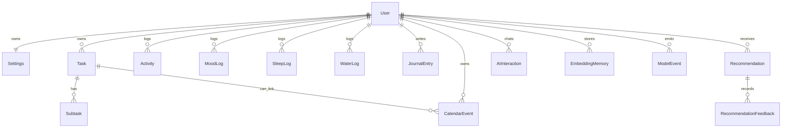
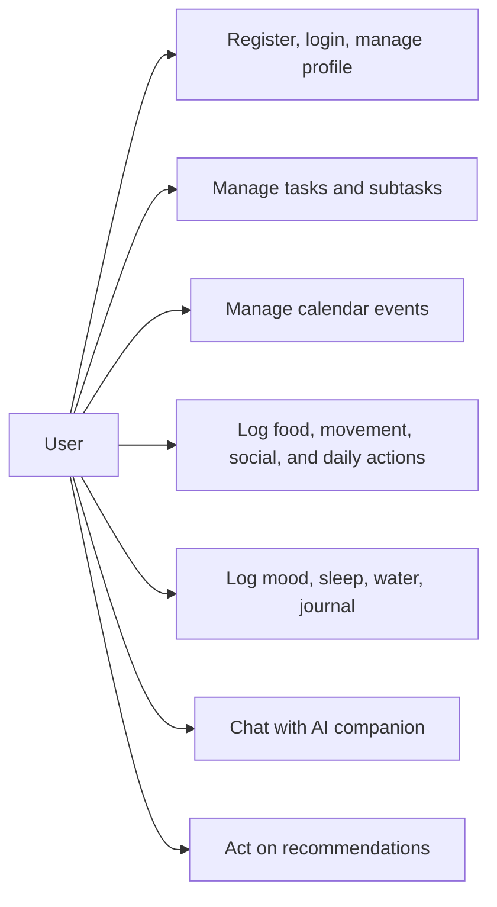
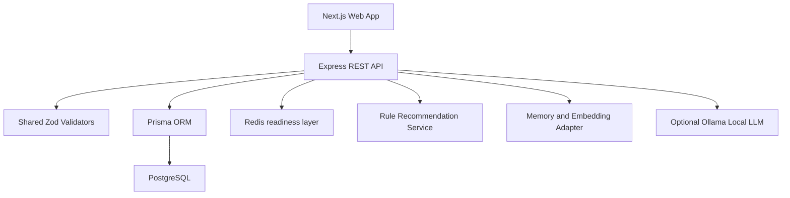
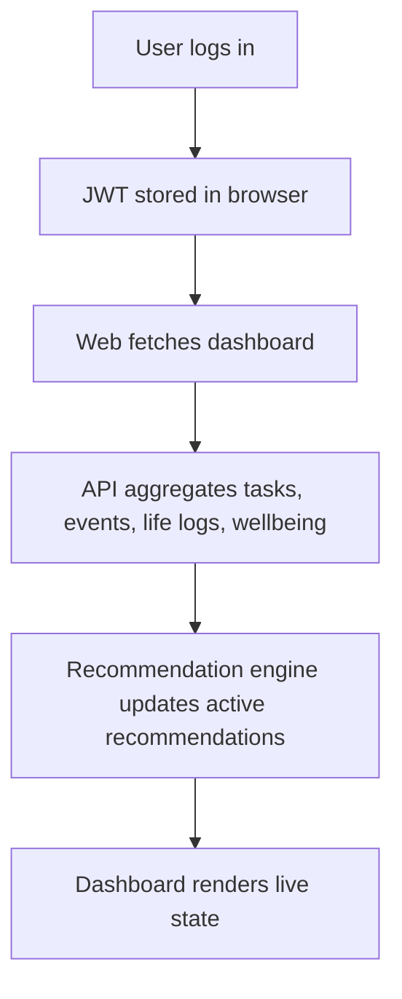
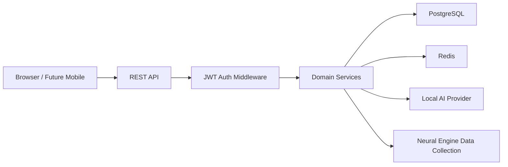
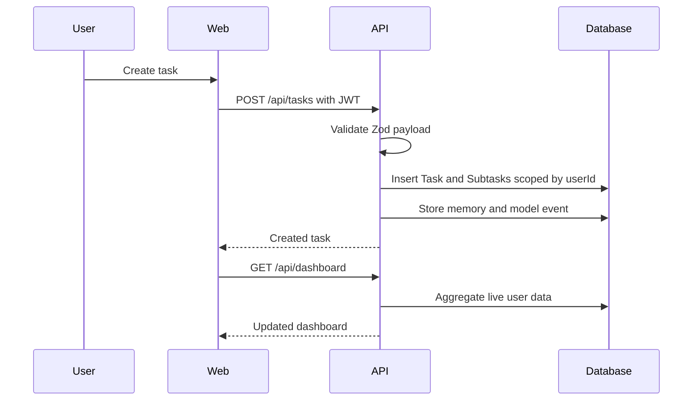

# Architecture Diagrams

## ER Diagram

```mermaid
erDiagram
  User ||--|| Settings : owns
  User ||--o{ Task : owns
  Task ||--o{ Subtask : has
  Task ||--o{ CalendarEvent : can_link
  User ||--o{ CalendarEvent : owns
  User ||--o{ Activity : logs
  User ||--o{ MoodLog : logs
  User ||--o{ SleepLog : logs
  User ||--o{ WaterLog : logs
  User ||--o{ JournalEntry : writes
  User ||--o{ Recommendation : receives
  Recommendation ||--o{ RecommendationFeedback : records
  User ||--o{ AIInteraction : chats
  User ||--o{ EmbeddingMemory : stores
  User ||--o{ ModelEvent : emits
```

## Use Case Diagram

```mermaid
flowchart LR
  User["User"] --> Auth["Register, login, manage profile"]
  User --> Tasks["Manage tasks and subtasks"]
  User --> Calendar["Manage calendar events"]
  User --> Life["Log food, movement, social, and daily actions"]
  User --> Wellbeing["Log mood, sleep, water, journal"]
  User --> Companion["Chat with AI companion"]
  User --> Insights["Act on recommendations"]
```

## Data Flow Diagram

```mermaid
flowchart TD
  Web["Next.js Web App"] --> API["Express REST API"]
  API --> Validators["Shared Zod Validators"]
  API --> Prisma["Prisma ORM"]
  Prisma --> Postgres["PostgreSQL"]
  API --> Redis["Redis readiness layer"]
  API --> Recs["Rule Recommendation Service"]
  API --> Memory["Memory and Embedding Adapter"]
  API --> Ollama["Optional Ollama Local LLM"]
```

## Flowchart

```mermaid
flowchart TD
  Login["User logs in"] --> Token["JWT stored in browser"]
  Token --> Fetch["Web fetches dashboard"]
  Fetch --> Aggregate["API aggregates tasks, events, life logs, wellbeing"]
  Aggregate --> Recommend["Recommendation engine updates active recommendations"]
  Recommend --> UI["Dashboard renders live state"]
```

## System Architecture

```mermaid
flowchart LR
  Browser["Browser / Future Mobile"] --> REST["REST API"]
  REST --> Auth["JWT Auth Middleware"]
  Auth --> Services["Domain Services"]
  Services --> DB["PostgreSQL"]
  Services --> Cache["Redis"]
  Services --> LocalAI["Local AI Provider"]
  Services --> Neural["Neural Engine Data Collection"]
```

## Sequence Diagram

```mermaid
sequenceDiagram
  participant U as User
  participant W as Web
  participant A as API
  participant D as Database
  U->>W: Create task
  W->>A: POST /api/tasks with JWT
  A->>A: Validate Zod payload
  A->>D: Insert Task and Subtasks scoped by userId
  A->>D: Store memory and model event
  A-->>W: Created task
  W->>A: GET /api/dashboard
  A->>D: Aggregate live user data
  A-->>W: Updated dashboard
```
